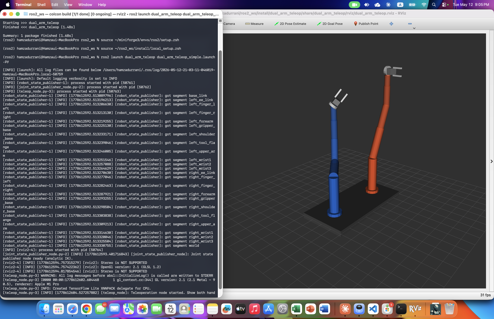

# MimicArm-dual_arm_teleop

Control two 6DOF robot arms in real time using nothing but your hands and a webcam.

Built with **ROS 2 Humble**, **MediaPipe**, and **MoveIt 2**. Visualised in **RViz**.


## Demo

> Both arms track your hand positions live in RViz. Pinch your fingers to close the grippers.


<!-- Record a screen capture of RViz and save as docs/demo.gif -->


## Overview

This project implements a complete hand-gesture teleoperation system for a dual 6DOF robot arm setup. An operator stands in front of a standard RGB webcam — no depth camera required — and controls both robot arms simultaneously using natural hand movements.

The system maps:
- **Hand position (X, Y)** → End-effector position in the robot workspace
- **Wrist rotation** → End-effector yaw (rotation around Z axis)
- **Pinch gesture** (index + thumb) → Gripper open / close

The robot model, joint states, and all motion are visualised live in RViz. The `/joint_states` topic is published at 30 Hz, allowing a real robot to subscribe and follow directly.


## System Architecture

```
┌─────────────┐     image frames     ┌──────────────────────┐
│   Webcam    │ ──────────────────▶  │   teleop_node.py     │
└─────────────┘                      │                      │
                                     │  MediaPipe Hands     │
                                     │  EMA noise filter    │
                                     │  Velocity clamp      │
                                     │  Gripper hysteresis  │
                                     └──────────┬───────────┘
                                                │
                          /left_arm/ee_target_pose
                          /right_arm/ee_target_pose
                          /left_arm/gripper_close
                          /right_arm/gripper_close
                                                │
                                     ┌──────────▼───────────┐
                                     │  joint_state_        │
                                     │  publisher_node.py   │
                                     │                      │
                                     │  Analytic IK solver  │
                                     │  (MoveIt 2 optional) │
                                     └──────────┬───────────┘
                                                │
                                          /joint_states
                                                │
                              ┌─────────────────▼──────────────┐
                              │   robot_state_publisher + RViz  │
                              │   Dual 6DOF arms visualised     │
                              └─────────────────────────────────┘
```


## Features

- **Dual 6DOF arms** with two-finger grippers, defined in URDF/xacro
- **Real-time hand tracking** via MediaPipe Hands (no depth camera needed)
- **2D end-effector movement + 1D rotation** per arm
- **Gripper control** via pinch gesture with hysteresis to prevent chatter
- **Noise handling** — EMA smoothing + velocity clamping + deadband filtering
- **Self-collision avoidance** via MoveIt 2 (optional; analytic IK fallback included)
- **Single-operator safety** — only the first detected hand per side is tracked
- **Hold-on-loss** — arms hold last position when hands leave the frame
- **30 Hz joint state publishing** — compatible with real robot controllers


## Gesture Controls

| Gesture | Action |
|---------|--------|
| Move right hand left / right | Right arm moves laterally |
| Move right hand up / down | Right arm moves vertically |
| Rotate right wrist | Right arm end-effector rotates (yaw) |
| Pinch right index + thumb | Close right gripper |
| Release pinch | Open right gripper |
| Same gestures, left hand | Controls left arm + left gripper |


## Prerequisites

### ROS 2 Humble

**Ubuntu 22.04 (recommended):**
```bash
sudo apt install ros-humble-ros-base python3-colcon-common-extensions
sudo apt install ros-humble-robot-state-publisher ros-humble-xacro \
  ros-humble-rviz2 ros-humble-tf2-ros ros-humble-tf2-geometry-msgs \
  ros-humble-joint-state-publisher
```

**macOS M1/M2 (via RoboStack + Miniforge):**
```bash
# Install Miniforge
curl -L https://github.com/conda-forge/miniforge/releases/latest/download/Miniforge3-MacOSX-arm64.sh -o miniforge.sh
bash miniforge.sh

# Create environment
conda create -n ros2 python=3.11 -y
conda activate ros2
touch ~/miniforge3/setup.sh   # required fix for RoboStack on macOS

# Add RoboStack channel and install ROS 2
conda config --add channels robostack-staging
conda config --add channels conda-forge
conda config --set channel_priority strict
conda install ros-humble-desktop -y
conda install ros-humble-robot-state-publisher ros-humble-xacro \
  ros-humble-tf2-ros ros-humble-tf2-geometry-msgs \
  ros-humble-joint-state-publisher -y

pip install colcon-common-extensions
```

### Python dependencies

```bash
pip install "numpy<2" "mediapipe==0.10.9" opencv-python
```


## Installation

```bash
# 1. Create workspace
mkdir -p ~/ros2_ws/src
cd ~/ros2_ws/src

# 2. Clone the repository
git clone https://github.com/YOUR_USERNAME/dual_arm_teleop.git

# 3. Build
cd ~/ros2_ws
colcon build --symlink-install

# 4. Source
# Ubuntu:
source install/setup.bash

# macOS:
touch ~/ros2_ws/local_setup.sh ~/ros2_ws/local_setup.bash
source ~/miniforge3/envs/ros2/setup.zsh
source ~/ros2_ws/install/local_setup.zsh
```


## Running

### Simple mode (no MoveIt required — works on macOS)

```bash
ros2 launch dual_arm_teleop dual_arm_teleop_simple.launch.py
```

### Full mode (with MoveIt 2 self-collision avoidance)

```bash
# Install MoveIt 2 first
sudo apt install ros-humble-moveit   # Ubuntu only

ros2 launch dual_arm_teleop dual_arm_teleop_full.launch.py use_moveit:=true
```

### Launch arguments

| Argument | Default | Description |
|----------|---------|-------------|
| `camera_index` | `0` | OpenCV camera index |
| `publish_rate` | `30.0` | Publisher frequency in Hz |
| `ema_alpha` | `0.25` | Smoothing factor (0.1 = smooth, 0.5 = responsive) |
| `show_preview` | `true` | Show OpenCV hand tracking window (Linux only) |
| `use_moveit` | `true` | Enable MoveIt 2 planning (full launch only) |
| `launch_rviz` | `true` | Launch RViz visualisation |


## Expected Output

When launched successfully you will see:

**Terminal output:**
```
[robot_state_publisher] got segment left_upper_arm ... (24 segments total)
[joint_state_publisher_node] Joint state publisher node ready (analytic IK).
[teleop_node] Teleoperation node started. Show both hands to begin.
[rviz2] OpenGl version: 2.1
```



**RViz window:**
- A shared base platform with two robot arms — blue (left) and orange (right)
- Both arms start in the home position (raised, elbows bent)
- As you move your hands in front of the camera, the corresponding arm follows
- Pinching closes the gripper fingers visibly in RViz

**ROS topics (verify with `ros2 topic hz /joint_states`):**
- `/joint_states` publishing at ~30 Hz
- `/left_arm/ee_target_pose` and `/right_arm/ee_target_pose` updating with hand position
- `/left_arm/gripper_close` and `/right_arm/gripper_close` toggling on pinch


## Project Structure

```
dual_arm_teleop/
├── CMakeLists.txt
├── package.xml
├── README.md
├── config/
│   ├── dual_arm_robot.srdf      # MoveIt 2 planning groups + collision pairs
│   ├── joint_limits.yaml         # Velocity and acceleration limits
│   ├── kinematics.yaml           # IK solver configuration
│   └── teleop_params.yaml        # Default node parameters
├── launch/
│   ├── dual_arm_teleop_simple.launch.py   # Analytic IK, no MoveIt
│   └── dual_arm_teleop_full.launch.py     # Full MoveIt 2 stack
├── rviz/
│   └── dual_arm_teleop.rviz
├── scripts/
│   ├── teleop_node.py                  # Hand tracking → EE pose publisher
│   ├── motion_planner_node.py          # MoveIt 2 IK + joint state publisher
│   └── joint_state_publisher_node.py   # Analytic IK joint state publisher
└── urdf/
    └── dual_arm_robot.urdf.xacro       # Dual 6DOF arms + two-finger grippers
```


## Noise Handling Design

| Mechanism | Purpose |
|-----------|---------|
| **EMA filter** (`alpha=0.25`) | Smooths raw MediaPipe landmark jitter |
| **Velocity clamp** (8 mm/frame) | Prevents large jumps when hand re-enters frame |
| **Deadband** (3 mm) | Suppresses micro-tremor when holding still |
| **Gripper hysteresis** | Prevents rapid open/close chatter at pinch threshold |
| **Hold-on-loss** | Arms hold last position when hands leave the frame |
| **Single-operator lock** | Only first detected hand per side is tracked |


## Troubleshooting

| Problem | Fix |
|---------|-----|
| `Camera not opening` | Grant Terminal camera permission in System Settings → Privacy → Camera |
| `No hands detected` | Ensure good front lighting, stand 0.5–1.5 m from camera |
| `Arms jerky` | Lower `ema_alpha`: `ema_alpha:=0.15` |
| `Package not found` | Re-source: `source ~/ros2_ws/install/local_setup.zsh` |
| `mediapipe has no attribute solutions` | `pip install "mediapipe==0.10.9"` |
| `NumPy 2.x error` | `pip install "numpy<2"` |
| `NSWindow main thread error (macOS)` | Set `show_preview:=false` in launch args |


## References

- [MediaPipe Hands](https://google.github.io/mediapipe/solutions/hands) — hand landmark detection
- [MoveIt 2](https://moveit.ros.org) — motion planning and collision avoidance
- [ROS 2 Humble](https://docs.ros.org/en/humble) — robotics middleware
- [RoboStack](https://robostack.github.io) — ROS 2 conda packages for macOS/Windows
- Kinematic link lengths inspired by Universal Robots arm geometry — no UR source code used


## License

Apache 2.0
